# RPA Hub Lab

## Introduction

RPA Hub enable end-to-end automation for your organization. With a combination of UI interactions and element-based automations that interact between the various business applications, you can emulate user actions and eliminate mundane and repetitive human activities. Any ServiceNow's RPA Automation can be triggered from any Worlfow on the ServiceNow Platform, this allows to automate things that do not have protocal available such as REST API, SOAP, ssh, powershell etc. 

## Goal 

In this lab, we will automate the task of printing a visitor badge. We will place special emphasis on the recorder capabilities that can capture actions from your desktop or web applications and convert them into an automation flow using the recorder option in the RPA Desktop Design Studio application. When you record an automation, you won't need to create it manually using connectors or components. This is especially useful for new user who have never built an RPA project. Additionally, we will review some administrative aspects of the RPA Hub within the dedicated RPA Hub Workspace, including configuring the Bot process and managing required credentials.

## Use Case

ACME Inc. has a mandate to automate as much as possible within their organization to drive efficiency and reduce costs. They have identified the 'Visitor Access' process as highly repetitive and labor-intensive. As a member of ACME Inc.'s Automation Center of Excellence, you have been contacted to automate the task of a security agent printing a visitor badge.

The requirement is that this automation can be triggered by a ServiceNow workflow. ACME Inc. is using ServiceNow to modernize the experience for their employees and customers and to orchestrate end-to-end automation.

The Badging Application is a web-based application and does not have an API. Agents receive visitor information via email and then access the web interface to populate the Badge Printing form wich result in a lot of manual error, typo and delay for visitor waiting for their badge.

### Reviewing the badgine application

From a web browser, open that [Link](https://automationengine.westus2.cloudapp.azure.com) to access the web-based badging application. Afterward, you should see the authentication screen below.

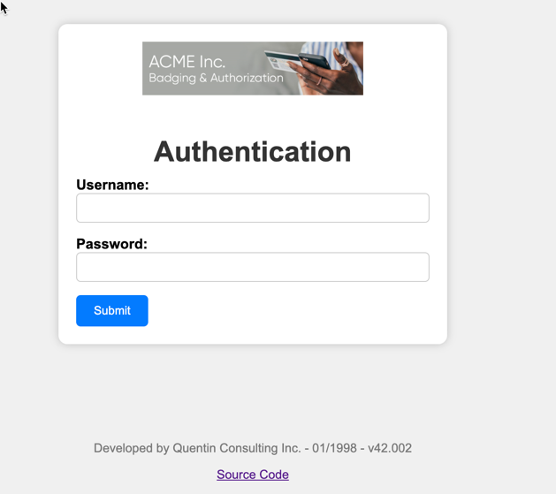

Type this credentials to authenticate then click Submit:

| Field | value |
   |-------|-------|
   | Username | badgeadmin |
   | Password | badgeadmin |

You should see that page below that Security Agent use to print badge

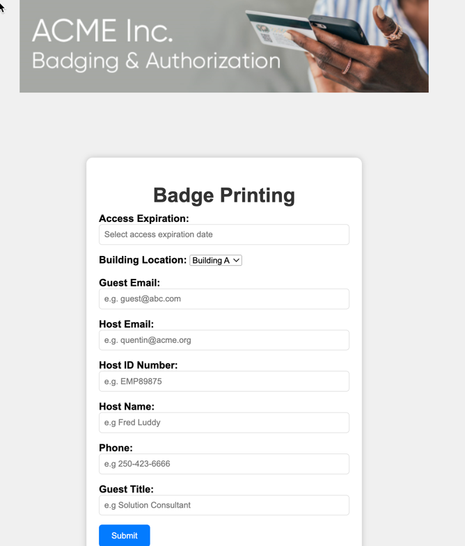

In our RPA automation project, we will automate all of those steps: opening the web browser, authenticating, performing the data entry, and submitting the form.

### RPA Hub Workspace

In the following step, we will perform some administrative tasks within the RPA Hub Workspace so that you can familiarize yourself with the various available configurations. Please log in to the instance assigned to you using the admin credentials you received when claiming that instance.

Click **All** (1), then type **RPA Hub** in the filter navigator (2) then click **RPA Hub Workspace

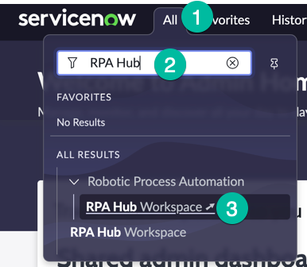

RPA Hub workspace is were govern, manage, and supervise your digital workforce all from one place.

In the top left-hand corner, click on the 'hamburger' icon to view the available lists

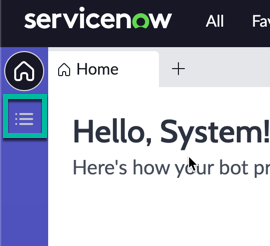

Click **Bot Process** (1) then **Assign Configuation** (Click the little arrow bext **Create Configuration**)

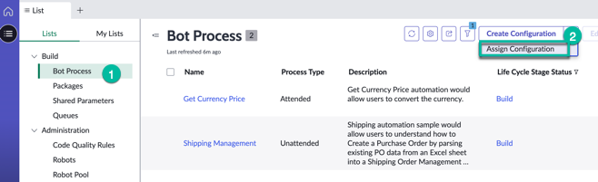

We are now creating a new **Bot process** from an existing **bot process configuration** and then we will populate the remaining fields required for it

Check the box (1) to select the **Badge printing - Bot process configuration** record then click **submit** (2)

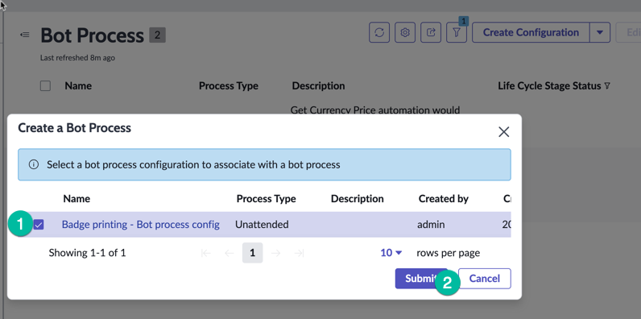

> This Badge Printing Bot process configuration record was preloaded in those lab instances to save time for the lab, allowing us to quickly focus on building the robot!"! Those configuration record are useful for customers that have multiple instances and needs to export the configuration from one instance to another.

This tab should open in the workspace, showing the bot process record, update the **Name** field (1) to rename the Bot Process. remove config then click **Save** (2) 

You want the Bot process **name** field to be as shown:

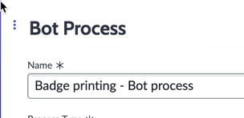

Now that we have this new Badge Pringing bot process record created, lets populate some fields that are important., Click on the **Business Applications** Tab

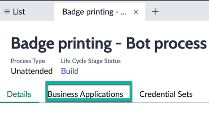

> Note: This aspect of the configuration is extremely important. In the Business Application tab, we will establish a relationship between the Bot Process and the RPA automation we are creating, connecting it to the specific Business Application we are automating. This configuration is stored in the CMDB (Configuration Management Database), enabling customers to keep their Automation team informed when planning changes to these business applications. Consider a scenario where one team is altering the UI of the Badging Application while another team is automating that UI. 
Another benefit of maintaining this relationship in the CMDB is that when an incident occurs in that application, it can be correlated with potential errors within the automation. Imagine if the business application goes down; the RPA robots may cease to function. Having visibility into potential root causes can be highly valuable."

Click **Add** to  map the existing Business Application (from CMDB) to the Bot Process

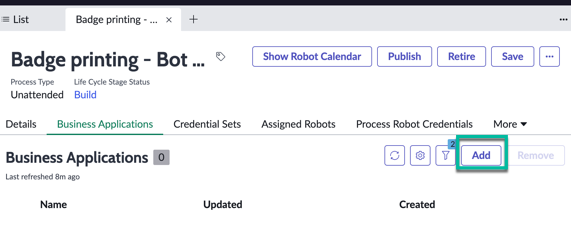

Select the **Badge Printing** (1)  Business application then click **Add** (2)

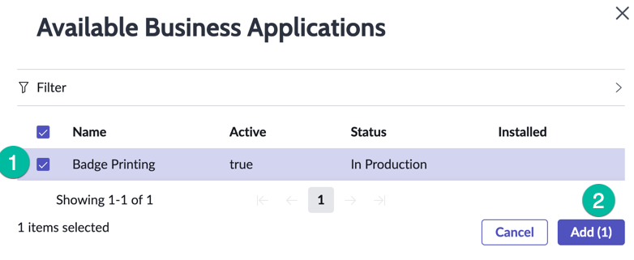

If you don't see the Busuness Application after adding it, clicl that recycle button as shown

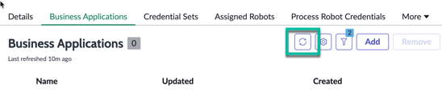

then you should see it in the Business Application tab as shown

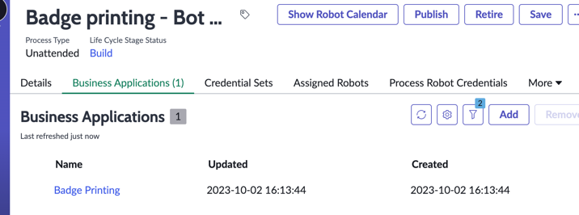

Lets continue with the configuration of the bot process, click on the **Credentials Set** tab (1), then click **New** (2)

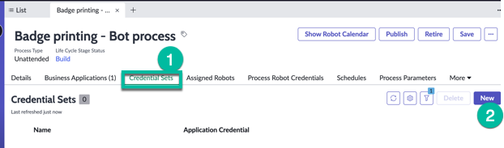

keep that tab open, we need to go grab additional information that we re goin to use in those field.

We need to grab the hostname of the Windows Virtual Machnine that was assigned to you, it just happened to be the same machine as the MID Server deployed with your instance

Click **All** (1) then type **mid** (2) in the filter navigator, then mouse over **Servers** then right click **Open Link in a new Tab** (just so we can keep the bot process page open)

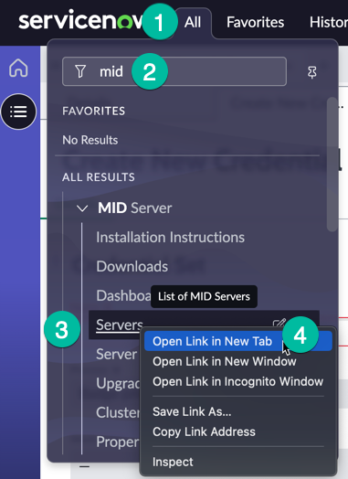

From that new tab, copy into your clipboard the value you see in the **Host Name** column as shown. Also note that hostname somewhere, we are going to use the value when creating the Robot record.

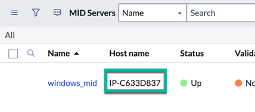

Then return to the Credentials Set tab in the RPA workspace

In the name field, past the previsouly copied value (hostname of mid server), then also in the Windows Username, past the hostname value followed by \Administrator

In the **windows password** field, type the password that was provided to you when you have claimed that lab instance then click **Save**

You show see a screen similar to this, allowing you to set the Application Credentials that will be use for that process (this is where we store the credentials for the robot to authenticate to that web badging app interface)

Click on **Application Credentials**

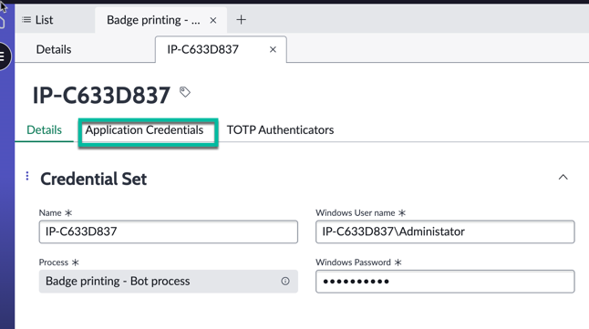

Then click **New**

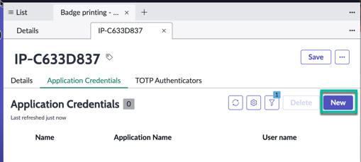

In the Create New Application Credentials form use the following values then click **Save**

| Field | Value |
   |-------|-------|
   | Name | Badging App Creds |
   | Application Name | Badge Printing |
   | User name | badgeadmin |
   | password| badgeadmin |

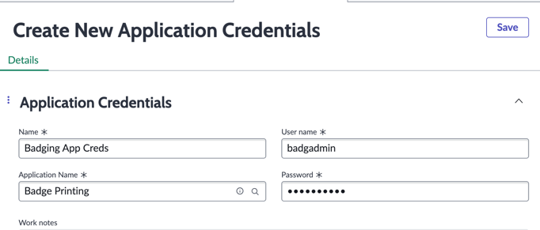

We need to create a Robot record before we can continue the configuation of the bot process (typically you would have an existing pool of Robots you can assign to a Bot process, in that lab we create that Robot record manually)

Click on the humbergur icon (1), then click on **Robots** (2) then clicl **New** (3) 

> Note: In ServiceNow RPA terminology, the Robot record corresponds to the Windows maching on which the ServiceNow's RPA Software agent runs a bot process, by defining the Robot on the Bot Process we are configuring which Virtual Machine will run the automation.

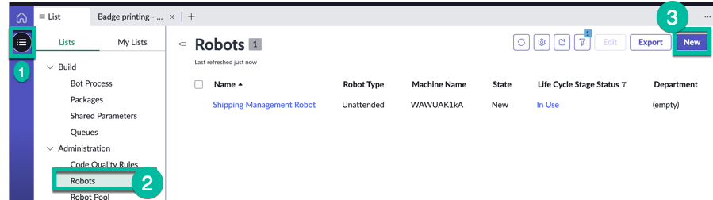

In this form populate the fields with the following values then click **Save**

| Field | value |
   |-------|-------|
   | Name | Badge Printing Robot |
   | Machine Name | Host name you copied from the Mid Server record in previous step |
   | Department | IT |
   | Robot Type | Unattended |

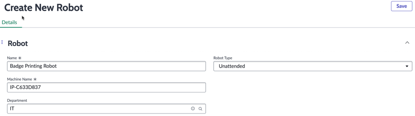

> Note: the Department field allows to slice and dice all the RPA Reporting per department.

Return to the Bot Process page by clicking on the **Detail** tab 

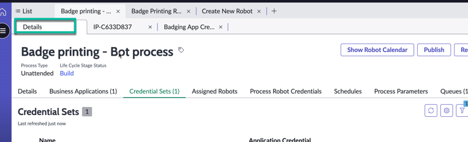

Then click on the **Assigned Robots** tab (1) then click **Add** (2) 

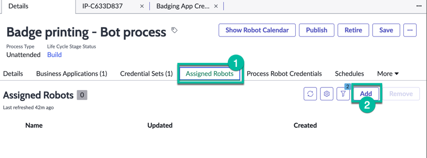

Select the **Badge Printing Robot** (1) record thgen click **Add** (2)

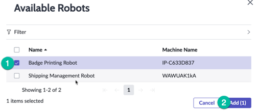

Click the refresh button 

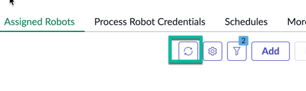

and make sure the robot record appears as shown in the **Assigned Robots** tab

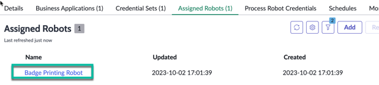

Now, let's configure the Process Robot Credentials. Process Robot Credentials link to the credential set we created earlier in the Robot record. This provides flexibility, especially when different robots use different credential sets. Additionally, some robots may also share the same credentials.

Click the **Process Robot Credentials** (1) then click **New** (2).

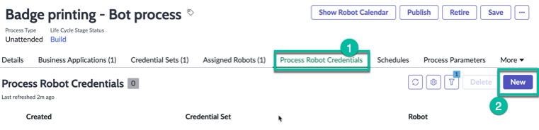

In the **Create New Process Robot Credential** form, on the **Credentials Set** field (1)  start typing 'IP-' it should return the name of the Credential Set record we previously created, select it (it happens to be your mid server hostname, in real life we might have to find a better naming convention :-) ), then on the **Robot** list field (2) search for 'Badge Printing robot' then select it and click **Save** (3)

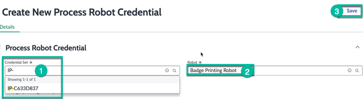

Return to the **Detail** tab to go back to the bot process details, then click on the **Queue** tab, if you don't see it, click the **More** button

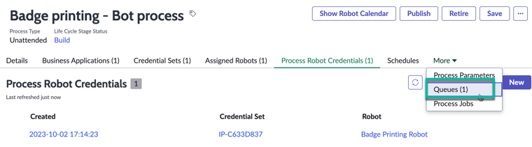

> A Queue is repository that can hold an unlimited number of work items. Work items can store multiple types of data, such as transaction information, customer details, or information from a document.Queues are used in automations to distribute transactional data or the workload among different robots

>Your instance came preconfigured with an existing Work Queue named 'Badge Printing'. In this use case, every time a visitor is pre-registered and approved to receive a badge, a no-code workflow (in Flow Designer) adds a Work Queue Item here to pass the metadata and information that the robot will need to submit the badge printing request

Click the **Badge Printing** Work Queue record to open and inspect it

When you're on the Work Queue record, click the Work Items tab (1) 

> this shows the pending, successful, or failed jobs. Work items can be assigned to robots through a flow, or you can design your RPA automation to schedule regular checks of the queue for pending work items, which are then assigned to specific robots.

Click the Work Item record **VIS0001016** (2)  to inspect it

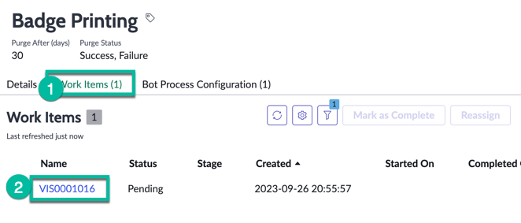

Review the different information available on that record, notice the 'Mark as complete' or 'Reassign' UI Actions, don't click those button please.

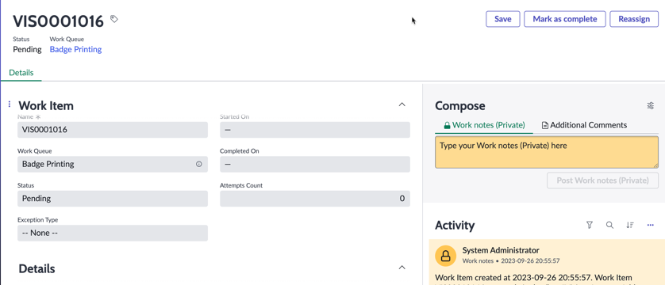

Scroll down until you see the request content field. This field contains the metadata that the Robot will need for data entry on the Badging web application. In this use case, a ServiceNow developer creates this work item from a flow and passes the metadata. Take note of the Response Content; the Robot can provide a response or information that can be read by a flow on the platform.

When we are building the RPA Automation, one of the first step will be to pick that work queue item and grab that metadata. 

We are done configuraing the RPA Bot Process in RPA Hub, now we need to build the RPA Automation that will be associated to that Bot Process.

# Building the RPA Automation
## Connecting to the VM

A Windows Virtual Machine (VM) will be needed to complete this lab. The IP address and login credentials were provided when registering for the lab. If using a Mac laptop, the Microsoft Remote Desktop App should have already been installed as a pre-requisite to this lab. 

 1. If using a Mac, connect to the lab VM by opening Microsoft Remote Desktop and clicking on the **plus sign** and then clicking **Add PC**. If using a Windows laptop, skip to **Step 6** to connect to the VM using Windows RDP.

     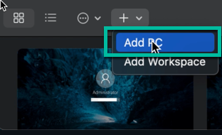

 1. Copy the **IP address** from the registration page and enter it under **PC Name** (1) and enter **Lab VM** under **Friendly Name** (2). Then click **Add** (3).

       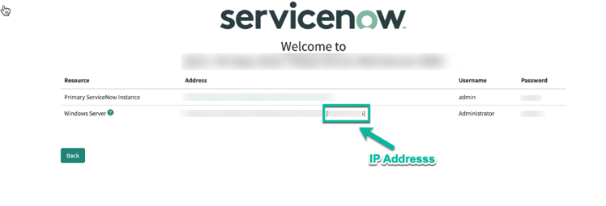
       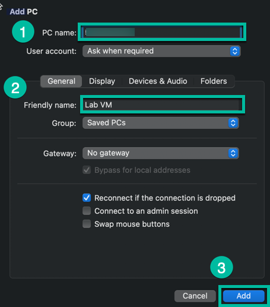

    > The **IP Address** is only the value within the **[]** brackets on the Windows Server line.

 1. Double click on the new VM that was added to RDP.

    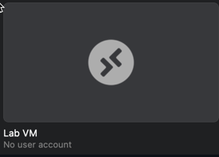
    
    Then click **Continue**.

 1. Enter the Windows Server login credentials provided during registration under **Username** (1) and **Password** (2) and then click **Continue** (3).

    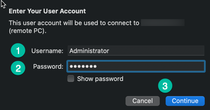

    > Click **Show Password** to ensure the entered password is correct.
    
 1. Click **Continue** once again to connect to the VM. After connecting to the VM, skip to **Step 11** to finish the initial set up.

    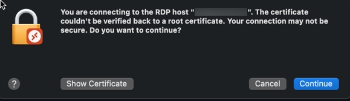

 1. If using a Windows laptop, open Remote Desktop Protocol (RDP). Then copy the **IP address** from the registration page and enter it for **Computer** (1) and click **Connect** (2).

    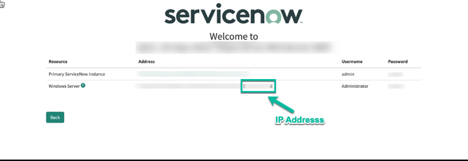

    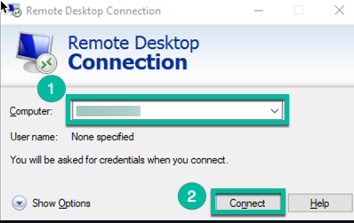
    > The **IP Address** is only the value within the **[]** brackets on the Windows Server line.

 1. Click **More choices**.

    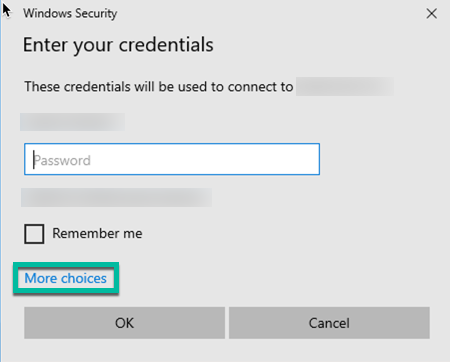

 1. Click **Use a different account**.

    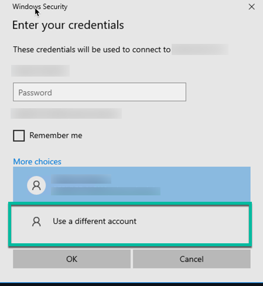

 1. Type **Administrator** for Username (1) and the **lab password** for Password (2). Then click **OK** (3).

    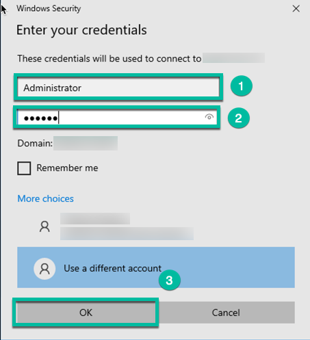

 1. Click **Yes** to confirm connectivity to the VM.

    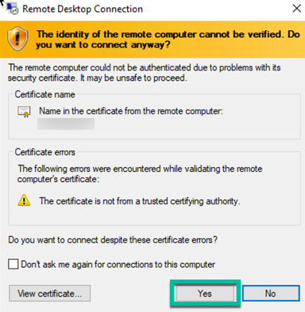

Once connected to the lab VM, notice that the RPA software is already pre-installed and accessible from the Desktop. If you don't see the RPA Desktop Design Studio icon, please let your instructor know as you are going to need this to build the RPA automation

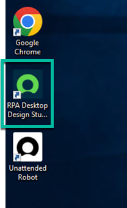

Before getting started, it is recommended to change the default browser to Chrome. This can be done by typing **Default Browser** (1) in the Windows Search Bar and clicking **Choose a default web browser** (2).

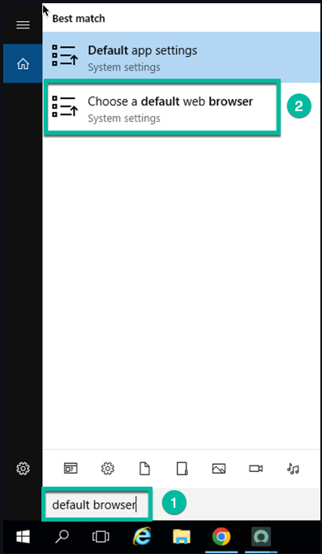

 Click **Internet Explorer** under **Web browser** and select **Google Chrome**. Then X out of the window.

 

## Getting Started with RPA Design Studio

Robotic Process Automation (RPA) Desktop Design Studio, which is a low-code Integrated Development Environment (IDE) where you can design or configure RPA automation workflows by dragging and dropping components to the design surface. RPA Desktop Design Studio is a Windows native application. 

Double click the RPA Desktop design studio icon from the windows desktop

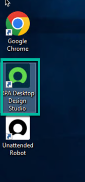

On the **Connection Manager** popup window, populate the fields with the information below

 | Field | value |
   |-------|-------|
   | Name | My Lab instance |
   | URL | Type the url of your lab instance, including http:// 
   | Mark as Default | Check the box |
   | Lunch in default browser | Check the box |

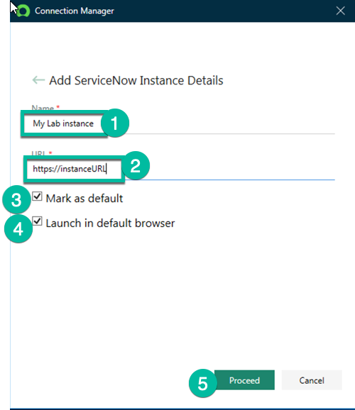

then Click **Proceed** (5)

The fist time Studio is open it can take a few minute to load all the components required 

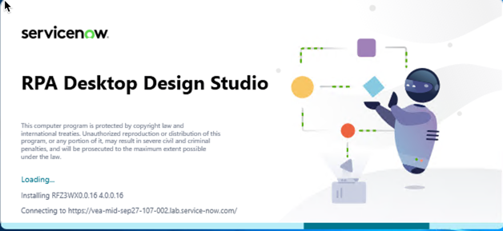

Once you see this welcome screen, click **Unattended Automation**

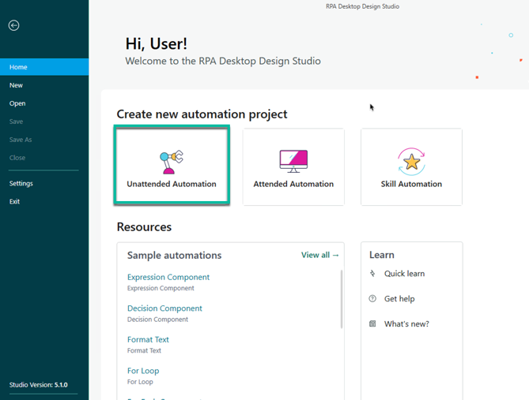

Use the values below in the **New Unattended Project** screen 

 | Field | value |
   |-------|-------|
   | Name (1) | Badge Printing RPA automation |
   | Description (2) | Automate the data entry in the badge printing web app
 

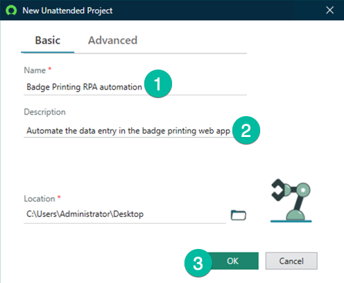

then click **OK** (3)

We are going to open Google Chrome and make sure we can access the Badging App from that VM. 

Click the windows Start menu (1), then double click **Google Chrome** (2)to open it

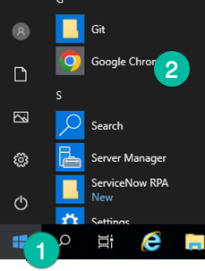

In the URL bar copy/past that URL https://automationengine.westus2.cloudapp.azure.com then press enter

 

You are likely to get some Security warning because that Web application uses a Root Certificate that is not trusted by this VM's browser. Click Advanced

Then click **Proceed to automationengine.westus2.cloudapp.azure.com (unsafe)**

> don't worry about those warnings, we have developed that 'dummy' web badging app for lab purpose only, we do not transmit any sensitive data whatsoever.

You should see the Authentication screen below that confirms that this Robot has access to that Web Application:

Before we close google chrome, in the url bar, type chrome://extensions and press enter, and make sure the ServiceNow RPA Chrome extension is enabled. this is needed for the Robot to be able to interact with Google Chrome.

Back to RPA Desktop design studio.

We are going to use our Universal App Connector to Start Google Chrome and open the URL of the Badging app, for this, expand the **Connectors** Section (1), then drag the **Universal App Connector** (2) and drop it under the **Global Objects** (3)

Expand the **Global Objects** to show the **Universal Application** as shown

Double click the **UniversalApplication**(1) to expose the **Start** Method (2) available under the object explorer on the left-hand side.

Drag and Drop the **Start** method to the canvas as shown 

Connect the Start object to the UniversalApplicaton Component, then connect the UniversalApplication component to the End Object as shown

Double click the AppType field

 

select **Chrome** then click ok

Double click the **StartParams** 

And past this URL https://automationengine.westus2.cloudapp.azure.com

Right click on the UniversalApplication component and click **Run from here** 

>Note: We perform this to test a step. It should open the web browser and navigate to the Badging Web application automatically (keep the browser open on that page, you can minimize it)

The component is in Green, indicating it ran successfully:

In RPA Design studio, On the top left hand corner, clicl the **Launch Recorder button"

THen Maximize the google chrome window

Now it is time to press that 'record' button and start recording the data entry step in that Badging Web Application. the recorder will capture the steps, and create a new activity containing the components needed for that automation.

Putting the mouse over the Username field should expose this **Set Text** option 

Click on **Set Text**

Type the vlaue **badgeadmin** (1) then click **Record** (2) 

Mouse over the Password field then click **Set Text**

In the field (1) type the password 'badgeadmin', then check the box **Mark Data as sensitive** (2) then click **Record** (3)

Mouse over the **Submit** button then press **Click**

This should redirect you to the Badge Printing form as shown:

Mouse over the **Access Expiration** field (1) and click set text (2), type the value 2023-12-28 (3) then click **Record** (4)

Mouse over the Building Location list field (1), then click **Select Item** (2), type the value **Building B** (3), then click **Record** (4)

Continue to do the same for the following fields using those values

 | Field | value |
   |-------|-------|
   | Guest Email | visitor@abc.com |
   | Host Email | fred@acme.com |
   | Host ID Number | EMP12345 |
   | Host Name | Fred Luddy |
   | Phone| 250-123-6666 |
   | Guest Title | Solution Consultant |

After capturing all the text fields, mouse over the submit button 

It shoud return a message saying **Badge Printed** as shown

We are done capturing the action with the recording, click on the Pause recording button as shown below:

The recorded should have captured 12 steps, click **Save Recording**

On the Save Recording as field Type **Data Entry** (1), and BadgePrinting for the Global Object Name (2), then click **Save Recording** (2)

You should now see that new activity in studio created by the recorder, it contains all the components needed to automate the data entry for that badge printing web application

Lets test if the automation created with the recorder works!

Close Google Chrome if it is still open. 

In Studio, click on the **Main** tab to show the Main Activity 

Once one the Main activity, locate the **Data Entry** Activity in the project explorer, then drag it to the canvas and connect it as shown below/ Between the UniversalApplicaton component and the End component.

Now we can test that main activity. if the Run button is greyed out, click the **Clear log** button

then Click **Run** 

> This is how you test your automation as you add new step to your project. think about this as a debugger.

You must have seen the browser opening automatically, then the authentication screen and the form being filled out automatically. The components should be all green, showing that every step executed successfully

Now that we know that the components all working. we need to get the values from the Work Queue Item. because so far the steps in the Data Entry activity are using hardcoded values that we have typed while using the recorder. We want to make that automation dynamic and get the metadata from the work queue item from the Queue in RPA Hub. 

In order to be able to retrieve a work queue item from the instance, we need to connect studio to your instance.. Click on the **Connect to Instance** icon

A new browser session in google chrome should open automatically, type your instance credentials and click Log in

Click on **Allow** on the next screen to authorize studio to authenticate with your instance.

Click select the check box and click Open **ULT.RPA.HOST**

When Studio is connected successfully to your instance you should see that Green dot next to your instance URL at the bottom of the screen

In Studio, clicl the **Toolbox** tab (1), then expand the **RPA Hub** Section, then drag the **Queue** Component (3) and drag and drop it to under the **Global Objects in the** Project Explorer as shown

From the Project Explorer, Click the **Queue** Component (1) under the **Global Objects** then type the name 'Badge Printing' (2).
This is how the Work Queue was named in RPA Hub on the instance. 

Click the Queue object in the Globak objects from the Project Explorer, this should expose the available methods in the object Explorer on the left hand side. Drag the **PickWorkitem** component (2) and drop it on the canvas between the Start object and the UniversalApplication Components as showns. Make sure to connect the components together as shown

On the Queue component on the canvas, double click the Status field (1), then select Static (2) on the **Read Data From** option,(3)

Select **Pending** and click **OK**

We are using that component to grab the metadata from the instance, we want to only pickl the work queue item with status pending. at the end of the automation we will update that work queue item as 'Completed'

Mouse over the **Queue** component to show the Gear icon, and click it

Click on the **JSON PROPERTIES** (1) then click the + icon (2) eight times to add eight properties

{"AccessExpirationDate":"2023-11-11","AccessExpirationDate":"Building AZ","guestemail":"ashley.burney@mycorpabc.com","HostEmail":"john@example.com","HostIdNumber":"123456","HostName":"John Doe","phone":"555-123-4567","Guest Title":"Guest"}

Copy/Paste each of the value from table below to the property fields as shown below then click OK

 | Property:|
   |-------|
   | BuildingLocation |
   | AccessExpirationDate |
   | guestemail  |
   | HostEmail |
   | HostIdNumber|
   | HostName | 
   | phone | 
   | Guest Title |

This extract the each value individually from the 'Request Content' field in the Work Queue Item, it now become available values in RPA to use while automating the data entry.

Now we are going to create new global variable then we will assign the values from the properties we just created.

In the Project Explorer, right click on **global Objects**, then click **Create a Variable**

Scroll done to show the **Variable** object, select it, then under **Properties** set the Name field to **BuildingLocation** instead if Variable 

Repeat this to create 8 global variable and use this value to name them (you already created the one named **BuildingLocation)

 | Property:|
   |-------|
   | BuildingLocation |
   | AccessExpirationDate |
   | guestemail  |
   | HostEmail |
   | HostIdNumber|
   | HostName | 
   | phone | 
   | Guest Title |

   You should end up with those eight variables as shown below:

   

Now we want to assign the values we extracted from the Work Queue Item to those variables.

On the Queue component in the canvas, mouse over the Data out port (orange/yelow dot) on the buildingLocation field then right click

On the Write Data To fieldm select **Variable** (1), then click **Select** (2) and click **OK** (3)

Select **Global** then select the Variable **BuildingLocation** and click **OK** (3)

Repeat this procedure for the seven remaining Objects 

The Queue component should look like this

Now we are going to modify the steps in the **Data Entry** Activity to use those global variable. Double click the Data Entry activity to open it

First we want the Robot to dynamically get the Badging App credentials from the instance. in the Toolbox, search for 'Credential' then Drag the component **GetApplicationCredentiak** (2) to the Canvas and connect it between the Start component and the Authentication component as shown:

Remember we have created at the begining of the lab some Application Credential called 'Badging App Creds', this is where we are going to use it.

Double click the Name field on the **Credentials** component and type 'Badging App Creds'

It should look like this below

In the top section of Studio, click the Assign Bot process button.
> Note: This step is needed so studio can impersonate as the Robot and access Credentials and other parameters configured at the Bot Process level on the instnace.

On the **Bot Process** field, Select 'Badge printing - Bot process'  and on the **Robot** field select 'Badge Printing Robot' then click **OK**

Locate thge 'Authentication' component on the canvas, just beside the 'Credentials' step, then right click on iot and select **Set Breakpoint**. This is going to allow us to just test the **Credentials** step without having the automation continuing to the following steps that we still have to update.

Now right click on the   **Credentials** step, then seklect **Run from here**. This will basically just execute that step and stop right after since we have implemented a Breakpoint on the following step.

Once that step executed, mouse over the UserName Data out port (yellow dot) to display the data. Notice we can see the value that was retrieve from the Credential set on the once. that step works :-) .

You can remove the Breakpoint on the Authentication step as shown, just select **Set Breakpoint** again to deactivate it.

Then click **Stop** to exit the debugger more

And click on **Clear log**

Now we need on to go on each component that sets value for the automation and replaced the hardcoded value that we used while recording the steps with the recorder and use our global variables to make things dynamic.

Locate the first 'SetText' component on the canva

Then as shown below, remove the text **badgeadmin**, and instead, grab the UserName Data out port from tjhe **Credentials** step and connect it to the Data in port of the SetText component as shown 

on the following SetText component (password1)

Remove the the text **badgeadmin**, then connect the Password data out port from the **Credentials** component to the data in port of the password1 step as shown:

Now the credentials are retrieved directly from the instance and will be used by the robot on the authentication screen of the web badging application.

Now we have to use our global variables to set the values on the badge printing form with the values that we are retrieving from the Work Queue Item

Locate the component SetText that have a date hardcoded

Then remove the hardcoded date, and configure that step to use the Global variable **AccessExpirationDate**

Repeat this procedure for all the other step of the automation to assign the value from the corresponding Global variable instead.

Once your are done the Data Entry activity should look like this. You should not see any hardcoded value on steps, but global variables instead.

We are almost done building the automation, click on the Main tab to return to the main activity

In the project explorer, under global objects, select **Queue** (1). thenm on the Objet explorer (on the left hand side), drag the **UpdateWorkItem** and drop it between the **Data Entry** step and the **END** Step (3) as shown

Make sure the component is connected as shown

Connect the WorkItemid Data out port of the **Queue/PickWorkItem** component, to WorkItemId data in port of the **Queue/UpdateWorkItem** component
Then click the property 'inProgress' of the Queue/UpdateWorkitem, then select the static value 'Success' this will update the WorkQueueItem on the instance as Success. This update can eventually be used to trigger a no code workflow on the platform to complete other task of the process.

We have now finished to build the automation. Click the Run buttong in Studio to try it!

