## RPA Hub Lab

## Introduction

Robotic Process Automation (RPA) is a transformative technology that has revolutionized the way businesses handle repetitive, rule-based tasks. It involves the use of software robots or "bots" to automate these tasks, allowing organizations to achieve greater efficiency, accuracy, and productivity. RPA Hub is ServiceNow's RPA technology that enable end-to-end automation for your organization. With a combination of UI interactions and element-based automations that interact between the various business applications, you can emulate user actions and eliminate mundane and repetitive human activities. Any ServiceNow's RPA Automation can be triggered from any Worlfow on the ServiceNow Platform, this allows to automate things that do not have protocal available such as REST API, SOAP, ssh, powershell etc. 

## Goal 

In this lab, we will automate the task of printing a visitor badge. We will place special emphasis on the recorder capabilities that can capture actions from your desktop or web applications and convert them into an automation flow using the recorder option in the RPA Desktop Design Studio application. When you record an automation, you won't need to create it manually using connectors or components. This is especially useful for new user who have never built an RPA project. Additionally, we will review some administrative aspects of the RPA Hub within the dedicated RPA Hub Workspace, including configuring the Bot process and managing required credentials.

## Use Case

ACME Inc. has a mandate to automate as much as possible within their organization to drive efficiency and reduce costs. They have identified the 'Visitor Access' process as highly repetitive and labor-intensive. As a member of ACME Inc.'s Automation Center of Excellence, you have been contacted to automate the task of a security agent printing a visitor badge.

The requirement is that this automation can be triggered by a ServiceNow workflow. ACME Inc. is using ServiceNow to modernize the experience for their employees and customers and to orchestrate end-to-end automation.

The Badging Application is a web-based application and does not have an API. Agents receive visitor information via email and then access the web interface to populate the Badge Printing form wich result in a lot of manual error, typo and delay for visitor waiting for their badge.

### Reviewing the badging application

From a web browser, open that [Link](https://automationengine.westus2.cloudapp.azure.com) to access the web-based badging application. Afterward, you should see the authentication screen below.

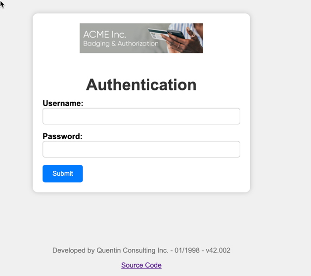

You may encounter security warnings since the web application uses a root certificate that is not trusted by the browser on this VM. . Click Advanced

Then click **Proceed to automationengine.westus2.cloudapp.azure.com (unsafe)**

> Don't worry about those warnings; we've developed that 'dummy' web badging app solely for lab purposes, and we do not transmit any sensitive data whatsoever.

Type this credentials to authenticate then click Submit:

| Field | value |
   |-------|-------|
   | Username | badgeadmin |
   | Password | badgeadmin |

You should see the page that the Security Agent uses to print badges below.

In our RPA automation project, we will automate all these steps: opening the web browser, authenticating, performing the data entry, and submitting the form.

### RPA Hub Workspace

In the next step, we will carry out some administrative tasks within the RPA Hub Workspace to help you become familiar with the various available configurations. Please log in to the instance assigned to you using the admin credentials you received when claiming that instance.

Click **All** (1), then type **RPA Hub** in the filter navigator (2) then click on **RPA Hub Workspace

The RPA Hub Workspace is where you can govern, manage, and supervise your digital workforce all from one place.

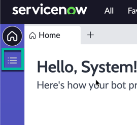

We are going to start with setting the Robot Credentials, we need to store in ServiceNow the Windows Credentials of your assigned Virtual Machine. (RPA HUB also support external credentials store)

In the top left-hand corner, click on the 'hamburger' icon to access the available lists, then under the **Credential Management** section, click on **Robot Credentials**

On the right side of the screen you should see the list of existing Robot Credentials, click the New button to add your windows credentials

This **Create New Robot Credential** form will open

Keep that tab open; we need to retrieve additional information that we're going to use in these fields

We need to obtain the hostname of the Windows Virtual Machine that has been assigned to you. Interestingly, it happens to be the same machine as the MID Server deployed with your instance

Click **All** (1) then type **mid** (2) in the filter navigator, then mouse over **Servers** then right click **Open Link in a new Tab** (just so we can keep the New Credential set form open)

From that new tab, copy the value you see in the **Host Name** column as shown into your clipboard. Additionally, make a note of the hostname as we will use this value when creating the Robot record.

Then return to the Credentials Set tab in the RPA workspace

On the **Name** field, paste the previously copied value (hostname of the MID Server), and also in the **Robot Username** field, paste the hostname value followed by \Administrator.

In the **Robot Password** field, Enter the password provided when you claimed that lab instance, and then click **Save**

Now that we have stored our Robot Credentials we can proceed with creating the credential group

>> The Credential group is to include a robot credential and application credentials that you can reuse in multiple bot processes. Unattended robots leverage the credential group to perform an automation that you defined in the associated bot process.

Navigate to Credential Management (1), then click **Credential Groups** (2)

Then click New

Type a Name for the Credential Group: My RPA Credentials Group
Select Robot Credentials we created earlier and click Save

We need to create a Robot record, Navigate to Administration, Robots then click New

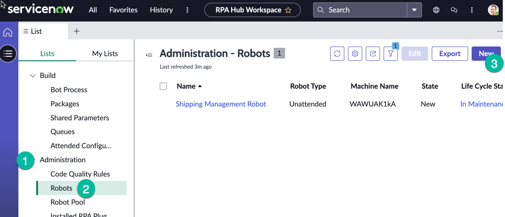

Fill out the form as followed, replace Machine Name by the value we copied earlier (Hostname of the virtual Machine assigned to you for this lab), in the User field assign your own user (Admin) then click Save

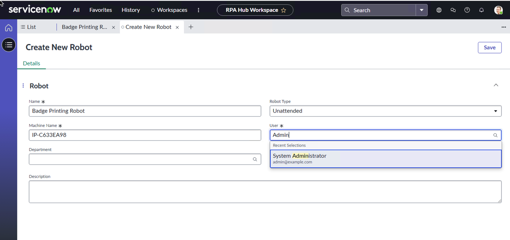

Click on Assigned Studio User to assign the permission to your user to use this Robot while developing the RPA Project

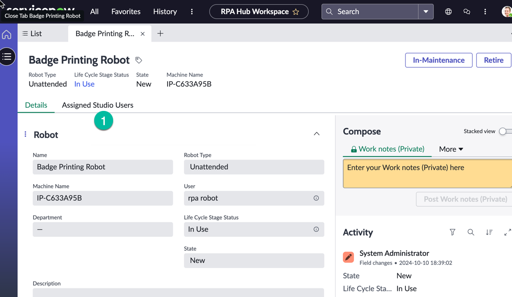

Click Add to add your user, select System Administrator and click Add as shown below: 

Click the refresh button to see your user in the list: 

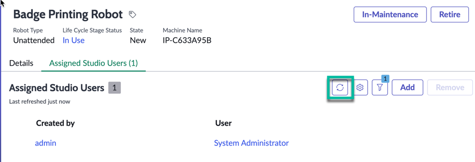

Now it is time to go create our Bot Process configuration. 

Click on **Bot Process** (1), then go to **Assign Configuration** (Click the little arrow next to **Create Configuration**)."

We are now creating a new **Bot process** from an existing **bot process configuration** and then we will populate the remaining fields required for it

Check the box (1) to select the **Badge printing - Bot process configuration** record then click **submit** (2)

> The Badge Printing Bot process configuration record was preloaded into those lab instances to save time, enabling us to quickly concentrate on building the robot. These configuration records are valuable for customers with multiple instances who need to export configurations from one instance to another.

This tab should open in the workspace, showing the bot process record, update the **Name** field (1) to rename the Bot Process. remove config then click **Save** (2) 

You want the Bot process **name** field to be as shown:

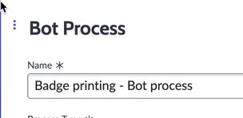

Now that we have this new Badge Pringing bot process record created, lets populate some fields that are important., Click on the **Business Applications** Tab

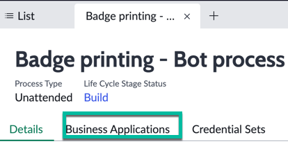

> Note: This aspect of the configuration is of utmost importance. In the Business Application tab, we establish a relationship between the Bot Process and the RPA automation we're creating, connecting it to the specific Business Application we're automating. This configuration is stored in the CMDB (Configuration Management Database), allowing customers to keep their Automation team informed when planning changes to these business applications. Consider a scenario where one team is modifying the UI of the Badging Application while another team is automating it.
Another advantage of maintaining this relationship in the CMDB is that when an incident occurs in that application, it can be correlated with potential errors within the automation. Imagine if the business application goes down; the RPA robots may stop functioning. Having visibility into potential root causes can be immensely valuable."

Click **Add** to  map the existing Business Application (from CMDB) to the Bot Process

Select the **Badge Printing** (1)  Business application then click **Add** (2)

If you don't see the Business Application after adding it, click that Refresh button as shown

then you should see it in the Business Application tab as shown

Lets continue with the configuration of the bot process, Click on Process Credential Mappings tab, then click Add

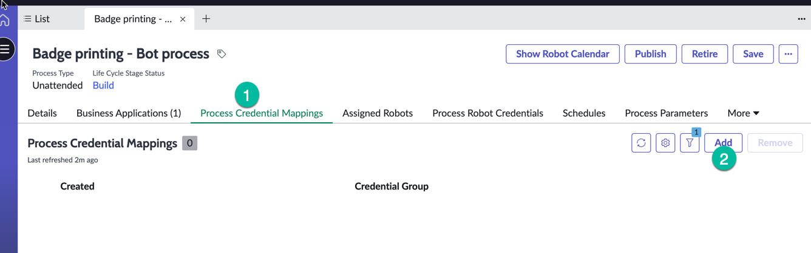

Select the Credential Group we created earlier (My RPA Credentials Group) then click Add

Click the refres button to confirm you see your Process Credential Mapping record as shown

Click on the **Assigned Robots** tab and click new to assign your Robot (VM) to the bot process

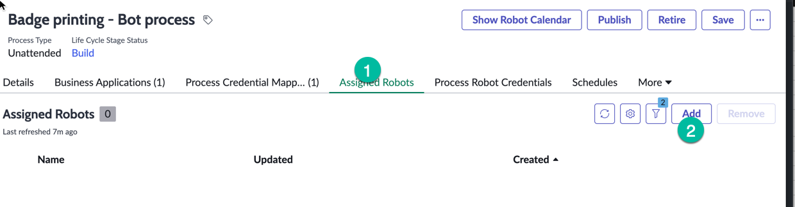

Select 'Badge Printing Robot' then click Add. Note that the Machine name should match the hostname of the Virtual machine assigned to you for this lab. 

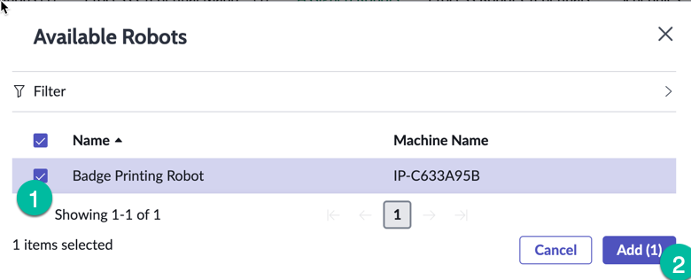

Click on the **Process Robot Credential tab and click New

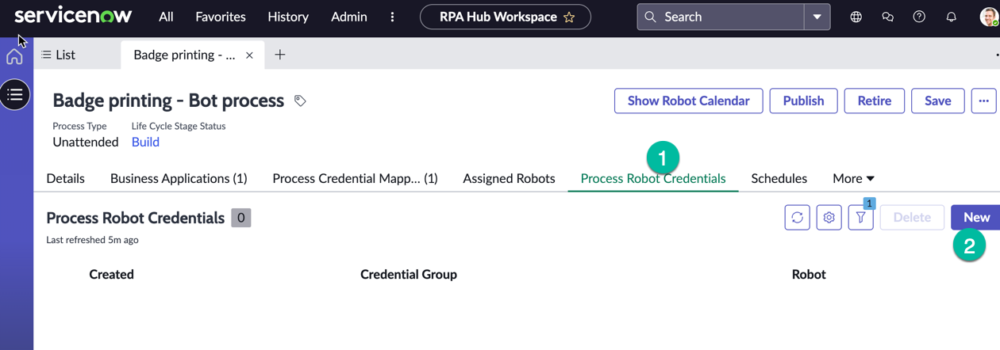

On the Credentials Group field select "My RPA Credentials Group" and on the robot field select "Badge printing Robot" then click Save.

We have mapped the Robot (VM) to the Bot Process, mapped the Robot Credentials to the Robot. we still need to set the Application Credentials so the Robot can authenticate with the system we are going to automate. 

Navigste to **Application Credentials** then click New to create a new record.

In the Create New Application Credentials form use the following values then click **Save**

| Field | Value |
   |-------|-------|
   | Name | Badging App Creds |
   | Application Name | Badge Printing |
   | User name | badgeadmin |
   | password| badgeadmin |

Navigte under Credential Management/Credential Group, click "My RPA Credentials Group"

Click Application Credential, then Click Add

Select Badging App Credentials then click Add

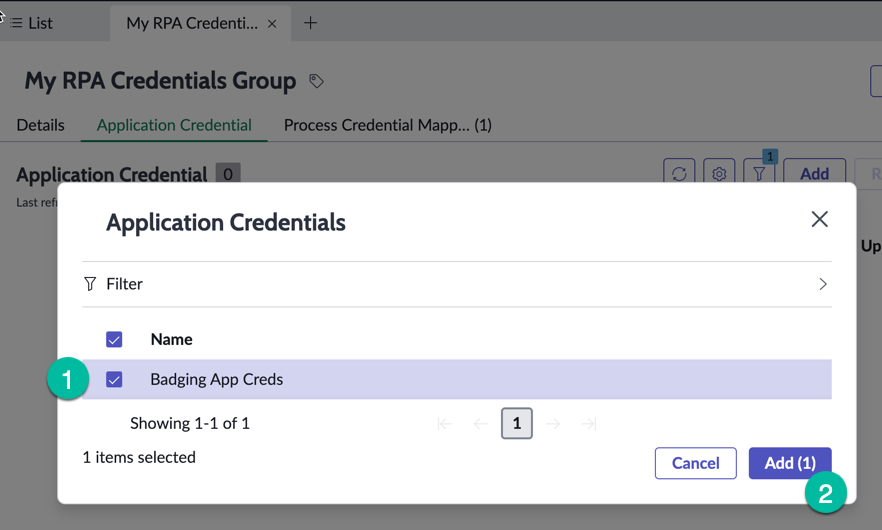

Click the Refresh button to make sure you see the updated configuration

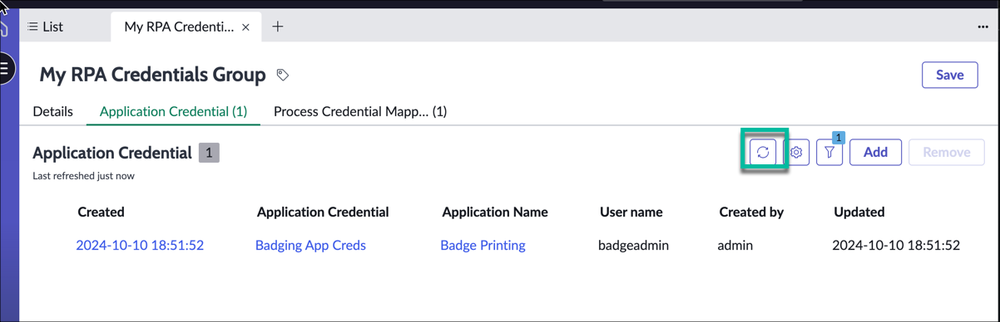

Return to your Bot Process configuration page

Ten click on the **Queue** tab, if you don't see it, click the **More** button

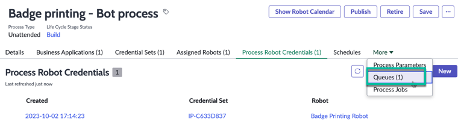

> A Queue is repository that can hold an unlimited number of work items. Work items can store multiple types of data, such as transaction information, customer details, or information from a document.Queues are used in automations to distribute transactional data or the workload among different robots

>Your instance came preconfigured with an existing Work Queue named 'Badge Printing'. In this use case, every time a visitor is pre-registered and approved to receive a badge, a no-code workflow (in Flow Designer) adds a Work Queue Item here to pass the metadata and information that the robot will need to submit the badge printing request

Click the **Badge Printing** Work Queue record to open and inspect it

When you're on the Work Queue record, click the Work Items tab (1) 

> This displays the pending, successful, or failed jobs. Work items can be assigned to robots through a flow, or you can design your RPA automation to schedule regular checks of the queue for pending work items, which are then assigned to specific robots.

Click the Work Item record **VIS0001016** (2)  to inspect it

Review the different information available on that record, notice the 'Mark as complete' or 'Reassign' UI Actions, don't click those button please.

Scroll down until you see the 'Request Content' field. This field contains the metadata needed by the Robot for data entry in the Badging web application. In this use case, a ServiceNow developer creates this work item from a flow and includes the metadata. Pay attention to the 'Response Content'; the Robot can provide a response or information that can be read by a flow on the platform.

When we are building the RPA automation, one of the first steps will be to select that work queue item and retrieve the metadata

We have finished configuring the RPA Bot Process in RPA Hub; now, we need to build the RPA Automation associated with that Bot Process.

# Building the RPA Automation
## Connecting to the VM

A Windows Virtual Machine (VM) is required to complete this lab. The IP address and login credentials were provided during registration. If you are using a Mac laptop, please ensure that the Microsoft Remote Desktop App has been installed as a prerequisite for this lab

 1. If using a Mac, connect to the lab VM by opening Microsoft Remote Desktop and clicking on the **plus sign** and then clicking **Add PC**. If using a Windows laptop, skip to **Step 6** to connect to the VM using Windows RDP.

     

 1. Copy the **IP address** from the registration page and enter it under **PC Name** (1) and enter **Lab VM** under **Friendly Name** (2). Then click **Add** (3).

       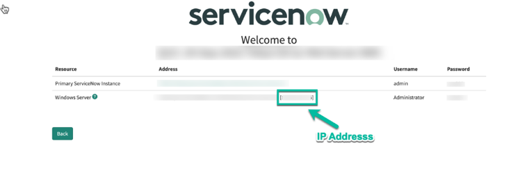
       

    > The **IP Address** is only the value within the **[]** brackets on the Windows Server line.

 1. Double click on the new VM that was added to RDP.

    
    
    Then click **Continue**.

 1. Enter the Windows Server login credentials provided during registration under **Username** (1) and **Password** (2) and then click **Continue** (3).

    

    > Click **Show Password** to ensure the entered password is correct.
    
 1. Click **Continue** once again to connect to the VM. After connecting to the VM, skip to **Step 11** to finish the initial set up.

    

 1. If using a Windows laptop, open Remote Desktop Protocol (RDP). Then copy the **IP address** from the registration page and enter it for **Computer** (1) and click **Connect** (2).

    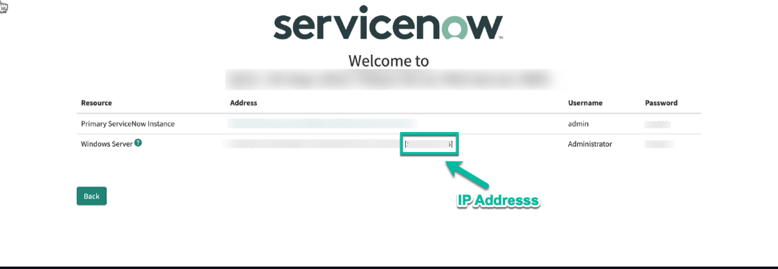

    
    > The **IP Address** is only the value within the **[]** brackets on the Windows Server line.

 1. Click **More choices**.

    

 1. Click **Use a different account**.

    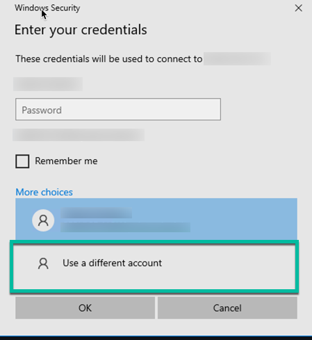

 1. Type **Administrator** for Username (1) and the **lab password** for Password (2). Then click **OK** (3).

    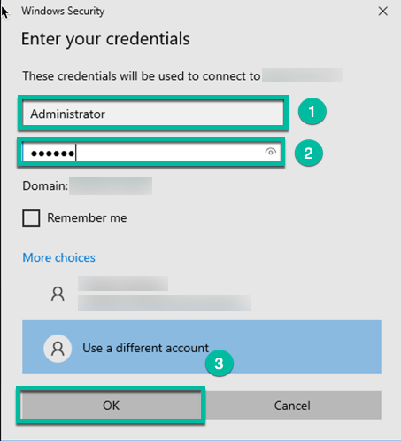

 1. Click **Yes** to confirm connectivity to the VM.

    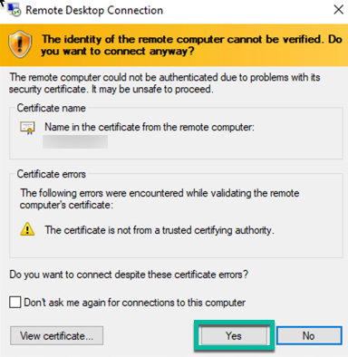

Once connected to the lab VM, notice that the RPA software is already pre-installed and accessible from the Desktop. If you don't see the RPA Desktop Design Studio icon, please let your instructor know as you are going to need this to build the RPA automation

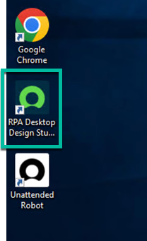

Before getting started, it is recommended to change the default browser to Chrome. This can be done by typing **Default Browser** (1) in the Windows Search Bar and clicking **Choose a default web browser** (2).

 Click **Internet Explorer** under **Web browser** and select **Google Chrome**. Then X out of the window.

 

## Getting Started with RPA Design Studio

Robotic Process Automation (RPA) Desktop Design Studio, which is a low-code Integrated Development Environment (IDE) where you can design or configure RPA automation workflows by dragging and dropping components to the design surface. RPA Desktop Design Studio is a Windows native application. 

Double click the RPA Desktop design studio icon from the windows desktop

On the **Connection Manager** popup window, populate the fields with the information below

 | Field | value |
   |-------|-------|
   | Name | My Lab instance |
   | URL | Type the url of your lab instance, including http:// 
   | Mark as Default | Check the box |
   | Lunch in default browser | Check the box |

then Click **Proceed** (5)

The fist time Studio is open it can take a minute to load all the components required 

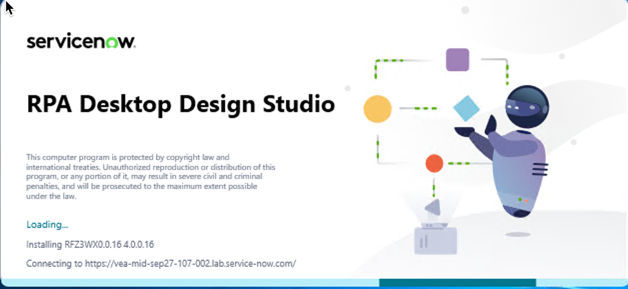

Once you see this welcome screen, you can click Cancel to close that window (feel free to follow the quick tour if time permit)

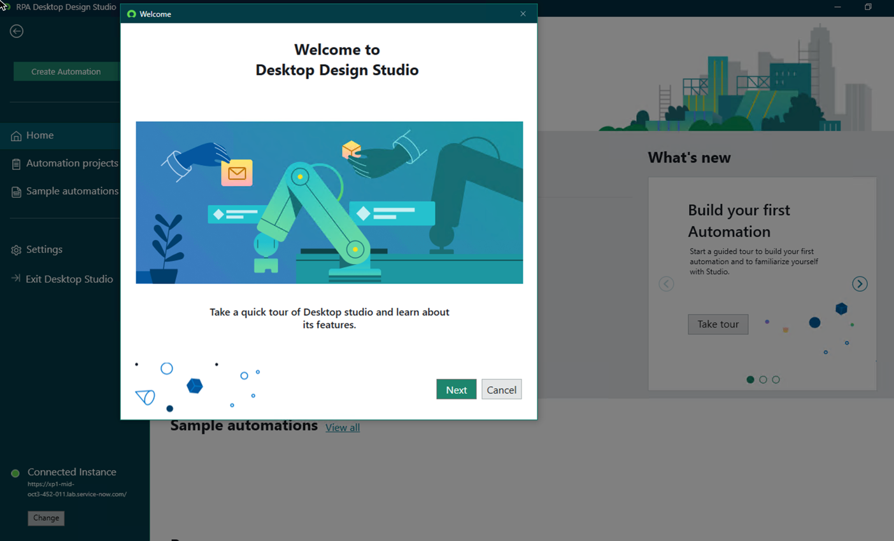

Click on **Create Automation**

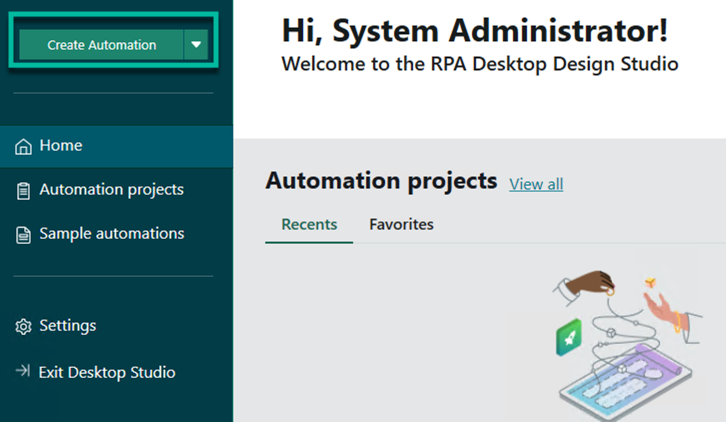

Select **Unattended Automation, type a Name and description as follow:

| Field | value |
   |-------|-------|
   | Name (1) | Badge Printing RPA automation |
   | Description (2) | Automate the data entry in the badge printing web app

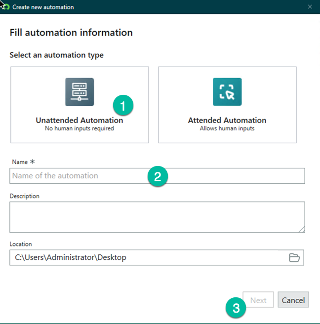

 
 
 Click Next

 Make sure **Use a blank Canvas** is selected then click **Create**

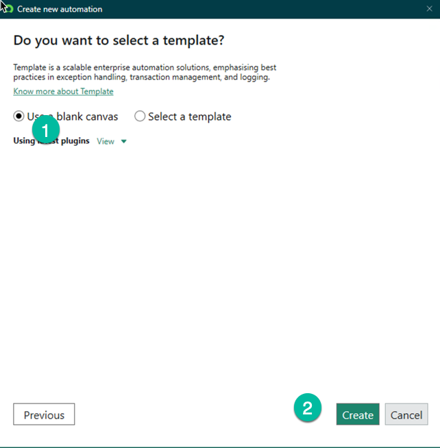

You should see Studio open with a blank Canvas as shown: 

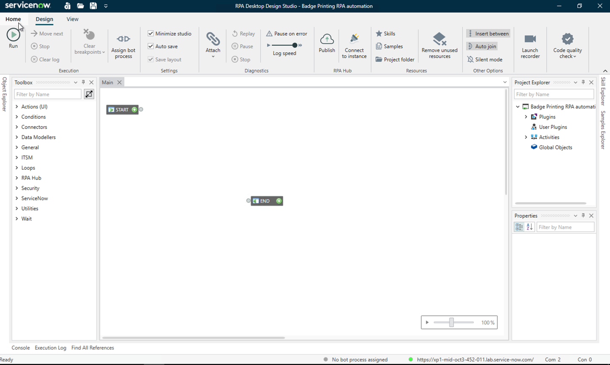

We are going to open Google Chrome and make sure we can access the Badging App from that VM. 

Click the windows Start menu (1), then double click **Google Chrome** (2)to open it

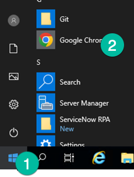

In the URL bar copy/past that URL https://automationengine.westus2.cloudapp.azure.com then press enter

 

You may encounter security warnings since the web application uses a root certificate that is not trusted by the browser on this VM. . Click Advanced

Then click **Proceed to automationengine.westus2.cloudapp.azure.com (unsafe)**

> Don't worry about those warnings; we've developed that 'dummy' web badging app solely for lab purposes, and we do not transmit any sensitive data whatsoever.

You should see the authentication screen below, confirming that this Robot has access to the web application:

Before closing Google Chrome, type 'chrome://extensions' in the URL bar and press Enter. Ensure that the ServiceNow RPA Chrome extension is enabled; it's necessary for the Robot to interact with Google Chrome

If you do not see the ServiceNow RPA Chrome Extension, please go on the Google Chrome store and install it as shown below:

Back to RPA Desktop design studio.

In RPA Design studio, On the top left-hand corner, click on the **Launch Recorder button"

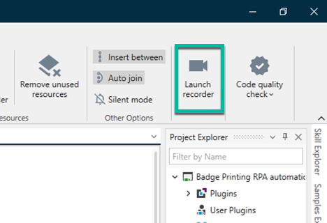

Then Maximize the google chrome window

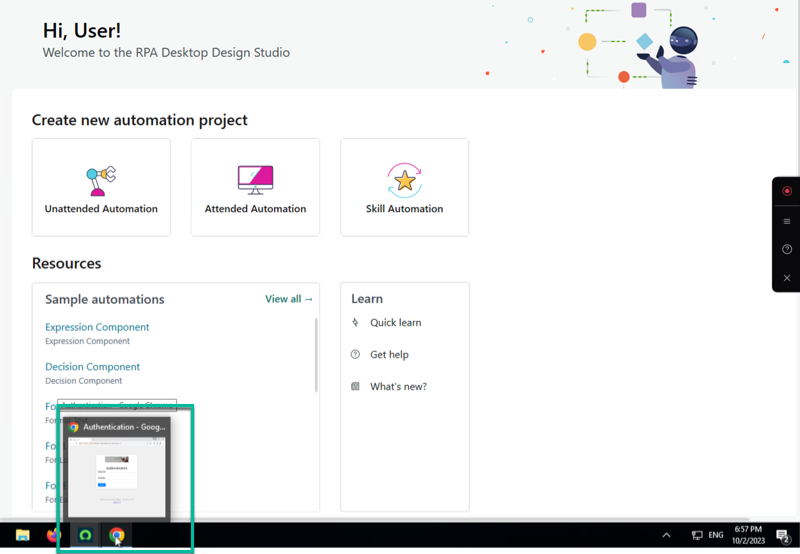

Now it's time to press the 'record' button and start recording the data entry step in the Badging Web Application. The recorder will capture the steps and create a new activity containing the components required for the automation.

Hovering over the Username field should expose this **Set Text** option 

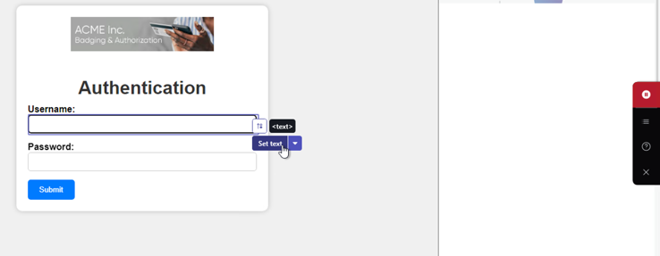

Click on **Set Text**

Type the value **badgeadmin** (1) then click **Record** (2) 

Hover the mouse over the Password field then click **Set Text**

In the field (1) type the password 'badgeadmin', then check the box **Mark Data as sensitive** (2) then click **Record** (3)

Hover the mouse over the **Submit** button then press **Click**

This should redirect you to the Badge Printing form as shown:

Hover the mouse over the **Access Expiration** field (1) and click set text (2), type the value 2023-12-28 (3) then click **Record** (4)

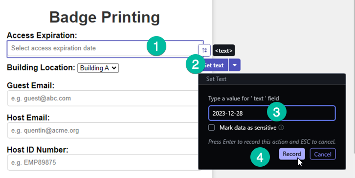

Hover the mouse over the Building Location list field (1), then click **Select Item** (2), type the value **Building B** (3), then click **Record** (4)

Continue to do the same for the following fields using those values

 | Field | value |
   |-------|-------|
   | Guest Email | visitor@abc.com |
   | Host Email | fred@acme.com |
   | Host ID Number | EMP12345 |
   | Host Name | Fred Luddy |
   | Phone| 250-123-6666 |
   | Guest Title | Solution Consultant |

After capturing all the text fields, hover the mouse over the Submit button then click the click action

It shoud return a message saying **Badge Printed** as shown

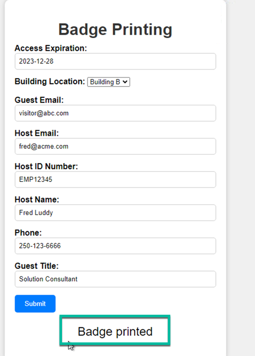

We are done capturing the actions with the recorder, click on the Pause recording button as shown below:

The recorded should have captured 12 steps, click **Review Recording**

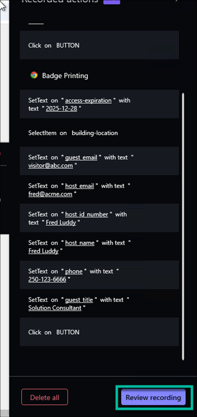

On the next screen click continue 

On the Save Recording as field Type **Data Entry**, and BadgePrinting for the Global Object Name, then click **Save Recording**

You should now see that new activity in studio created by the recorder, it contains all the components needed to automate the data entry for that badge printing web application

Lets test if the automation created with the recorder works!

Close Google Chrome if it is still open. 

The **Data Entry** activity created by the Recorder should show up in the Canvas, Right Click the **Start** component then Click **Run From Herer**

> This is how you test one activity independently before you add it to another activity or Main activity. 

You must have seen the browser opening automatically, then the authentication screen and the form being filled out automatically. The components should be all green, showing that every step executed successfully

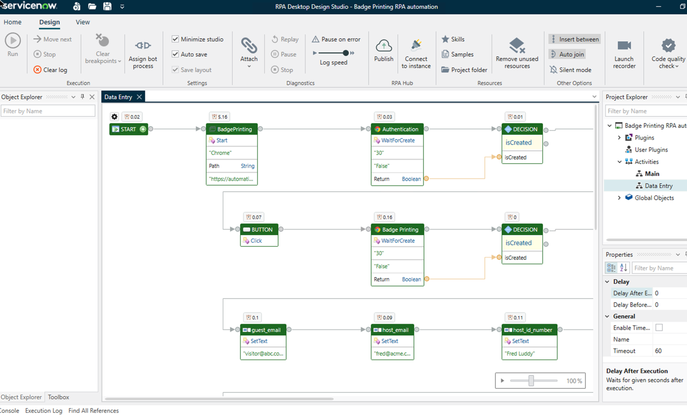

Now that we know that the components are all working, we need to retrieve values from the Work Queue Item. So far, the steps in the Data Entry activity are using hardcoded values that we typed while using the recorder. We want to make the automation dynamic by obtaining the metadata from the Work Queue Item in the Queue within RPA Hub.

To retrieve a work queue item from the instance, we need to connect Studio to your instance. Click on the Connect to Instance icon

In order to be able to retrieve a work queue item from the instance, we need to connect studio to your instance.. Click on the **Connect to Instance** icon

A new browser session in google chrome should open automatically, type your instance credentials and click Log in

Click on **Allow** on the next screen to authorize studio to authenticate with your instance.

Click select the check box and click Open **ULT.RPA.HOST**

When Studio is connected successfully to your instance you should see that Green dot next to your instance URL at the bottom of the screen

In Studio, double click the **Main** activity from the project explorer

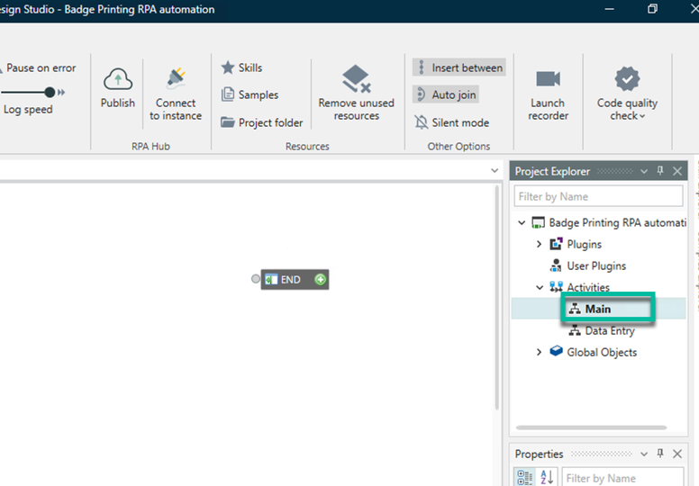

Think about that activity as the 'main' luncher, we will add other activities and components in the Main activity, that activity is the starting point of your automation project.

In Studio, click the **Toolbox** tab (1), then expand the **RPA Hub** Section, then drag the **Queue** Component (3) and drag and drop it to under the **Global Objects in the** Project Explorer as shown

From the Project Explorer, Click the **Queue** Component under the **Global Objects** then type the name 'Badge Printing'.

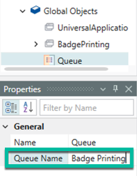

This is how the Work Queue was named in RPA Hub on the instance. 

Double click the Queue object in the Global objects from the Project Explorer, this should expose the available methods in the object Explorer on the left hand side. Drag the **PickWorkitem** component (2) and drop it on the canvas between the Start object and the UniversalApplication Components as showns. Make sure to connect the components together as shown

On the Queue component on the canvas, click the **gear** icon 

Select the **Status** field then click ok 

On the Queue component, double click the **Status** fiedl then select Static

Select **Pending** and click **OK**

We are using this component to retrieve metadata from the instance. We want to select only the work queue item with the status 'Pending.' At the end of the automation, we will update that work queue item to 'Success'.

Mouse over the **Queue** component to show the Gear icon, and click it

Click on the **JSON PROPERTIES** (1) then click the + icon (2) eight times to add eight properties

Copy/Paste each of the value from table below to the property fields as shown below then click OK

 | Property:|
   |-------|
   | BuildingLocation |
   | AccessExpirationDate |
   | guestemail  |
   | HostEmail |
   | HostIdNumber|
   | HostName | 
   | phone | 
   | Guest Title |

This extracts each value individually from the 'Request Content' field in the Work Queue Item, making them available as values in RPA to use during the data entry automation.

Next, we will create a new global variable and assign the values from the properties we just created.

In the Project Explorer, right click on **global Objects**, then click **Create a Variable**

Scroll down to show the **Variable** object, select it, then under **Properties** set the Name field to **BuildingLocation** instead if Variable 

Repeat this process to create eight global variables, and use these values as their names (note that you've already created the one named BuildingLocation).

 | Property:|
   |-------|
   | BuildingLocation |
   | AccessExpirationDate |
   | guestemail  |
   | HostEmail |
   | HostIdNumber|
   | HostName | 
   | phone | 
   | Guest Title |

   You should end up with those eight variables as shown below:

   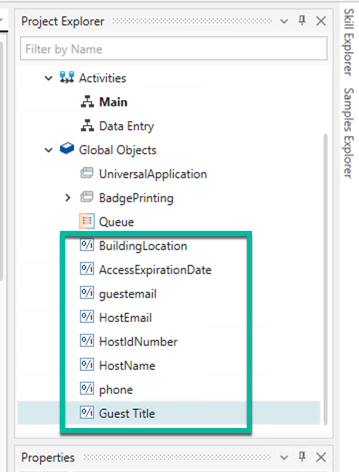

Now we want to assign the values we extracted from the Work Queue Item to those variables.

On the Queue component in the canvas, hover the mouse over the Data out port (orange/yelow dot) on the buildingLocation field then right click. and select Port Properties

On the Write Data To field select **Variable** (1), then click **Select** (2) 

Select **Global** then select the Variable **BuildingLocation** and click **OK** (3)

Repeat this procedure for the seven remaining Objects 

The Queue component should look like this

From the pick the **Data Entry** Activity and drop it on the **Main** activity, connect ther Queue component to the Data Entry component so it looks like the picture below:

Now we are going to modify the steps in the **Data Entry** Activity to use those global variable. Double click the Data Entry activity to open it

First, we want the Robot to dynamically retrieve the Badging App credentials from the instance. In the Toolbox, search for 'Credential,' then drag the component **GetApplicationCredential** (1) to the Canvas and connect it between the Start component and the Authentication component as shown:"

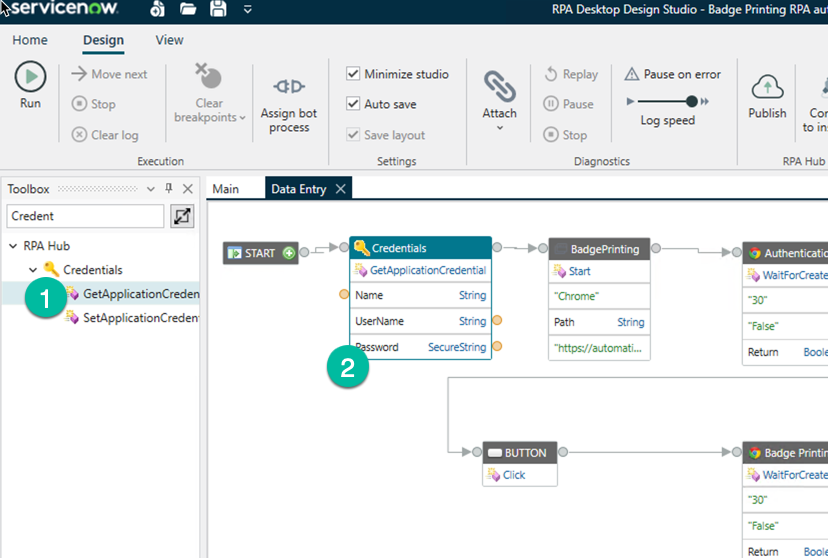

Remember, at the beginning of the lab, we created an Application Credential called 'Badging App Creds'; this is where we are going to use it

Double click the Name field on the **Credentials** component and type 'Badging App Creds'

It should look like this below

See the **Credentials** component is returning the password in a SecureString object, we need to add another component that is going to convert it to a String object so we can use it in a SetText component that accept only 'String' type of object.

In the toolbox, search for 'secure', to find the SecureStringDecode component from the Encryption folder as shown

Then Drag and Drop it so it is between the Credentials step and the Badge Printing/Start component

Then connect the Password data out port from the Credentials step the data in port (secureString) of the Encryption component

Remove the hardcoded value in the text/SetText component that contains the "badgadmin" value and also the encryted text in the Password1 component as shown:

Then connect the Data out port 'UserName' from the Credentials components to  data in port of text/SetText component, and connect the data out port of the **Encryption** comnponent to the data in port of the password1 component as shown

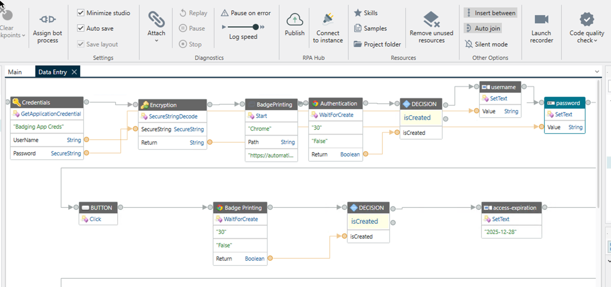

> Note: The robot will now use the value retrieved directly from the instance while authenticating the the badging web interface.

We have to use our global variables to set the values on the badge printing form with the values that we are retrieving from the Work Queue Item from the instance

Locate the component SetText that have a date hardcoded

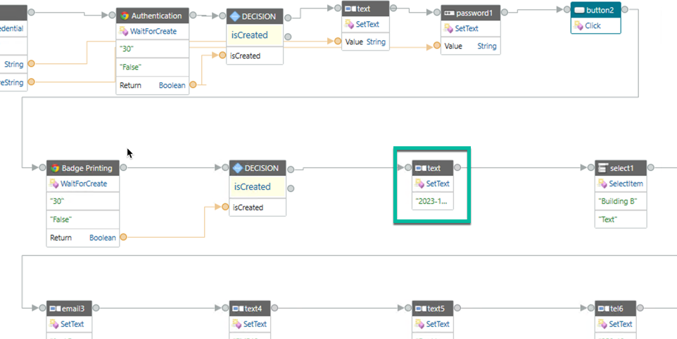

Then remove the hardcoded date, and configure that step to use the Global variable **AccessExpirationDate**

Repeat this procedure for all the other step of the automation to assign the value from the corresponding Global variable instead.

Once your are done the Data Entry activity should look like this. You should not see any hardcoded value on steps, but global variables instead.

We are almost done building the automation, click on the Main tab to return to the main activity (or double click the Main activity from the Activities folder from the Project Explorer)

In the project explorer, under global objects, select **Queue** (1). then on the Objet explorer (on the left-hand side), drag the **UpdateWorkItem** and drop it between the **Data Entry** step and the **END** Step (3), Make sure the component is connected as shown

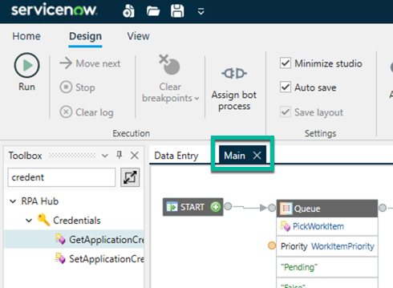

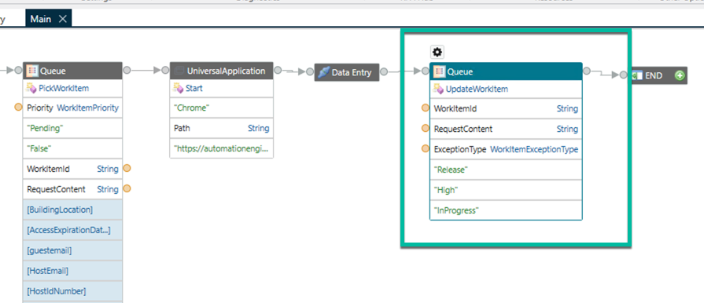

Connect the WorkItemid Data out port of the **Queue/PickWorkItem** component, to WorkItemId data in port of the **Queue/UpdateWorkItem** component
Then click the property 'inProgress' of the Queue/UpdateWorkitem, then select the static value 'Success' this will update the WorkQueueItem on the instance as Success. This update can eventually be used to trigger a no code workflow on the platform to complete other task of the process.

We have now finished to build the automation.

before we try it lets make sure Studio is connected to the instance by following those steps. Don't forget to Assign the Bot process too as shown: 

 Click the Run button in Studio to try it!

If you connect to the RPA Hub workspace, and inspect the Queue Work Item, you should see his status as 'Success', your ServiceNow Developer can then leverage that update as a Trigger in flow designer to trigger other step of the process, but that data entry in the legacy badging application is now automated with RPA Hub! 

You have successfully completed the lab!

## Don't have time to finish? 

If you are having difficulty building that automation, you can download the automation package from this link: [Link](https://github.com/quentincloudsnow/badgingappweb/blob/main/RPApackage/Badge%20Printing%20RPA%20automation%20Xanadu.zip). Extract it on the machine where you have RPA Studio and open it from Studio 